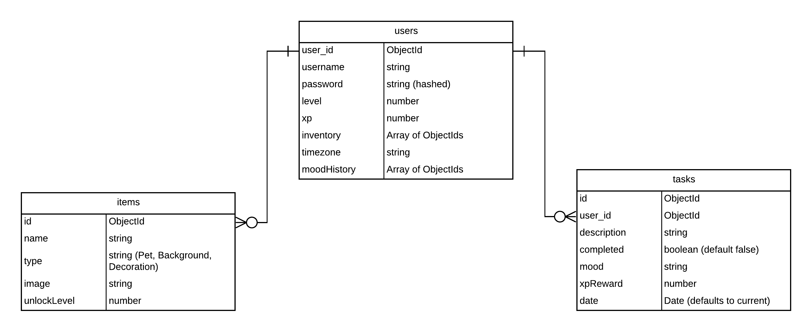

# Task-Buddy

# Overview

Task Buddy is a MEN stack CRUD app designed to make staying on top of your to-dos fun and rewarding. Every completed task earns you rewards to interact with your very own digital pet! Stay productive, level up, and turn your to-do list into a game you actually want to play! 🎮✅🐾

- PLACEHOLDER to add link for deployed app

Demo:

DEMO TO COME

## Techstack

Languages
- HTML
- CSS
- JavaScript 

MongoDB

## Installation
To install this app, please install the project dependencies and run it locally. Task Buddy is currently hosted on: 
PLACEHOLDER.

1. clone the repo
2. Run a terminal and cd into folder Client
3. 

## Wireframes and Data Model

More information and details can be found on: 
> [Trello](https://trello.com/b/8hcfUOeS/task-buddy).

Data Model:

## Difficulties/Unsolved Problems
- TBD

## Future Development

- TBD