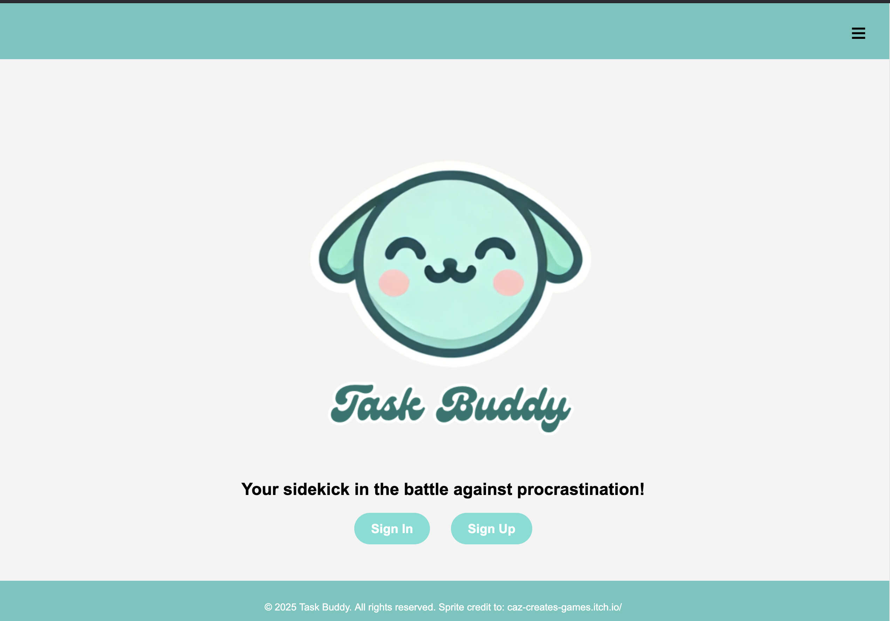

# 🐾 Task-Buddy

# Overview

Task Buddy is a MEN stack CRUD app designed to make staying on top of your to-dos fun and rewarding. Every completed task earns you rewards to interact with your very own digital pet! Stay productive, level up, and turn your to-do list into a game you actually want to play! 🎮✅🐾

>  [Task Buddy App - Try it out!](https://task-buddy-app-9018ca12f5dd.herokuapp.com/)

Youtube Demo:

## Techstack

🛠 Built With:
- Node.js + Express
- MongoDB + Mongoose
- EJS templating
- HTML/CSS/JS

Credit to [Caz-creates-games](caz-creates-games.itch.io) for the character sprites.

## 🚀 Installation
To install this app, please install the project dependencies and run it locally. Task Buddy is currently hosted on: 
>  [Heroku](https://task-buddy-app-9018ca12f5dd.herokuapp.com/)

1. clone the repo
2. Run a terminal and cd into folder Client
3. Install dependencies `npm install`
4. Seed initial data `node seed/items.js`
5. Start the app `npm run dev`
6. See the magic on your `http://localhost:3000`

## Wireframes and Data Model

More information and details can be found on: 
> [Trello](https://trello.com/b/8hcfUOeS/task-buddy).

Data Model:

## 💭 Difficulties/Unsolved Problems
- Inventory sync timing: Sometimes items earned on level-up don’t appear until after a manual refresh. Needs better real-time sync.
- Pet animation quirks: Sprite animations occasionally flicker or flip unexpectedly, especially on edge collision or smaller screens.
- Responsive design bugs: On mobile, some UI elements like the inventory or pet environment lose spacing or scale poorly.
- Session state persistence: Keeping selected pets and equipped items persistent across sessions needs improvement.
- Modal on level-up: Modal popup with rewards on level-up is not consistently displaying as expected.

## 🚧 Future Development

- Mood-based tasks: 
Add a mood tracker that influences or is influenced by the user's tasks (e.g., a task marked with "tired" might give more points if completed late at night).

- Mood journal / calendar view: 
Include a component that visualizes the user's daily mood entries alongside task completion.

- Multiple pets: 
Allow users to unlock, adopt, and switch between multiple pets. Each could have unique idle animations or effects.

- Drag-and-drop decor: 
Give players the ability to customize their pet's environment by dragging and placing unlocked decor wherever they want.

- Inventory expansion:
Add support for equipping multiple items at once (e.g., hat + background + toy), with possible save/load functionality.

- In-game store: 
Introduce a cute coin/reward system to "buy" cosmetics and pets beyond what’s unlocked by level.

- Cloud save & login enhancements: 
Add password reset, email verification, and potentially OAuth login for easier access.
